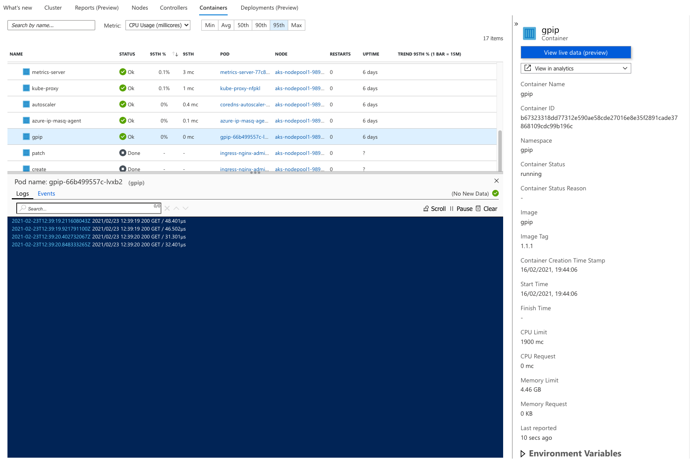

# Scaling and monitoring applications

In this lab, we will configure autoscaling and monitoring for our cluster.

## Pre-reqs

Before you begin with this lab, you need to have performed the previous lab:

* [Set up CI/CD with Flux](./04-setup-flux.md)

## Tasks

### Enable AKS monitoring

> **Note:** The following commands assume you've set the environment variables and Azure CLI default config from the [first lab](./00-setup-environment.md).

Create a Log Analytics workspace that will contain your cluster logs and metrics:

```bash
workspace=<workspace-name>
az resource create \
  --name $workspace \
  --resource-type Microsoft.OperationalInsights/workspaces \
  --properties '{}' -o table
```

Get your newly created Log Analytics workspace resource ID:

```bash
workspace_id=$(az resource show \
  --name $workspace \
  --resource-type Microsoft.OperationalInsights/workspaces \
  --query "id" -o tsv)
```

> **Note:** You may have to set the `cluster` environment variable again for this command to work.

Enable the monitoring addon for your cluster:

```bash
az aks enable-addons \
  --name $cluster \
  --addons monitoring \
  --workspace-resource-id $workspace_id
```

>**Note:** It can take a few minutes for data to appear from your cluster.

### Inspect cluster health

Open the [Azure portal][azure-portal] in your browser and find your cluster resource.

Scroll down to the **Insights** menu item under **Monitoring**. Review your cluster health. Below is an example:


### Configure live log data

Change directory to your `flux-cluster` repository location.

Create a file called `logreader-rbac.yaml` under `./clusters/lab-clusters/` and paste the following YAML:

```yaml
apiVersion: rbac.authorization.k8s.io/v1
kind: ClusterRole
metadata:
    name: containerHealth-log-reader
rules:
- apiGroups: ["", "metrics.k8s.io", "extensions", "apps"]
  resources:
  - "pods/log"
  - "events"
  - "nodes"
  - "pods"
  - "deployments"
  - "replicasets"
  verbs: ["get", "list"]
---
apiVersion: rbac.authorization.k8s.io/v1
kind: ClusterRoleBinding
metadata:
    name: containerHealth-read-logs-global
roleRef:
    kind: ClusterRole
    name: containerHealth-log-reader
    apiGroup: rbac.authorization.k8s.io
subjects:
- kind: User
  name: clusterUser
  apiGroup: rbac.authorization.k8s.io
```

Save the changes, then commit and push the file to your cluster repository:

```bash
git add -A && git commit -m "Add logreader RBAC"
git push
```

Wait for the changes to synchronize (about 30 seconds). Then go back to your cluster **Insights** in the Azure Portal.

Click the **Container** tab. Then click on `gpip`, followed by the button "View live data (preview)". You should now see container logs from `gpip`:

>**Note:** You might have to send some requests to `gpip` in order for logs to show up.



### Create horizontal pod autoscaler

Change directory to your `gpip` repository.

Create a new file called `hpa.yaml` under the `deploy` directory and paste the following:

```yaml
apiVersion: autoscaling/v2beta2
kind: HorizontalPodAutoscaler
metadata:
  name: gpip
  namespace: gpip
spec:
  scaleTargetRef:
    apiVersion: apps/v1
    kind: Deployment
    name: gpip
  minReplicas: 1
  maxReplicas: 10
  metrics:
  - type: Resource
    resource:
      name: cpu
      target:
        type: Utilization
        averageUtilization: 2

```

Edit `deployment.yaml` and change `resources: {}` to contain the following:

```yaml
resources:
  requests:
    cpu: 250m
    memory: 64Mi
  limits:
    cpu: 250m
    memory: 128Mi
```

Save the changes, then commit and push the file to your cluster repository:

```bash
git add -A && git commit -m "Add requests and HorizontalPodAutoscaler"
git push
```

The changes should be synchronized to your cluster shortly.

### Enable cluster autoscaling

Cluster autoscaling adds and removes nodes when needed. To enable cluster autoscaling, run the following command:

```bash
az aks update \
  --name $cluster \
  --enable-cluster-autoscaler \
  --min-count 1 \
  --max-count 5
```

Wait a few minutes, and the autoscaler should be enabled.

### Run a load test

Edit the Nginx ingress controller deployment:

```bash
kubectl edit deployment ingress-nginx-controller -n ingress-nginx
```

Update the number of replicas from 1 to 2.

Start a load test by running the command below. It will create an Azure container instance for you that will run the test.

>**Note:** If you have enabled SSL/TLS, use HTTPS instead of HTTP for your endpoint.

```bash
gpip_endpoint=http://gpip.$external_ip.nip.io/
az container create \
   --name loadtest \
   --cpu 4 \
   --memory 1 \
   --image azch/artillery \
   --restart-policy Never \
   --command-line "artillery quick -r 1000 -d 180 $gpip_endpoint" 
```

>**Note:** You might have to re-run the load test a few times.

Watch as your pods scales up in order to handle the load:

```bash
kubectl get hpa -n gpip -w
```

## Summary

After finishing this lab, you should have achieved the following:

* Enabled monitoring for your cluster
* Know how to inspect the current cluster state
* Viewed pod logs
* Enabled both cluster and pod autoscaling
* Run a load test against your application

## Next step

Congratulations! You are done with the second session. Clean up your Azure resources by deleting the resource group they are contained in:

```bash
az group delete -n $group
```

<!-- References -->

[azure-portal]: https://portal.azure.com/
